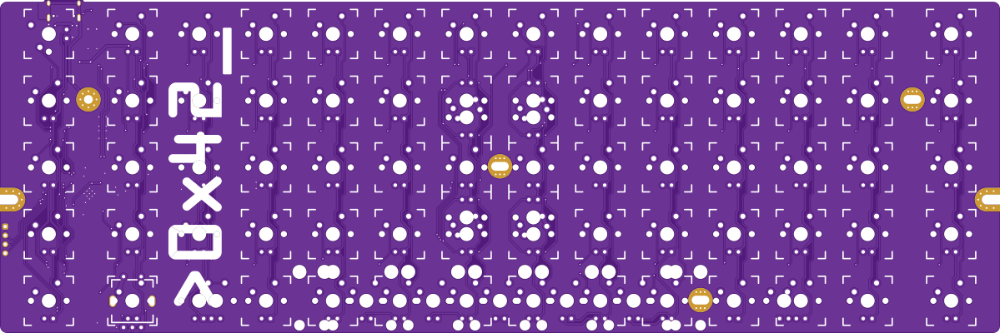
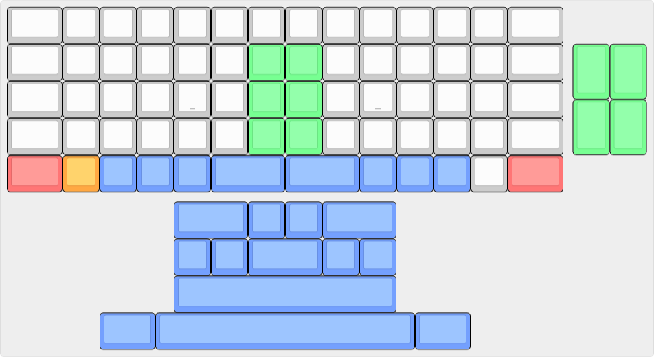

# >__0x42___


_Render generated by the [tracespace.io](https://tracespace.io/view/) site._

> **DISCLAIMER :**
> This PCB has been designed with Kicad6 and prototyped in late 2022.
> As of December 2023, I use Kicad7 and have converted the files to the new revised format.
> This is not expected to introduce any bug, but I do not offer any guarantee against it and provide the files AS-IS.
> You are therefore advised to perform an in-depth review of the design before manufacturing/assembly.

## Introduction
__0x42__ is an open-source 60% ortholinear keyboard PCB designed to fit the (_de facto_) standard 60% keyboard cases and use an ergo keycap set (1u alphas, with 1.5u modifiers and -optional- split 2u spacebars).

Heavily inspired by the [Boardwalk][boardwalk-url] (although the variety of supported layouts is much lower, see below), __0x42__ is based on a Raspberry Pi RP2040 (ARM) MCU with onboard USB-C connexion (or through a daughterboard), it allows the use of a rotary encoder and has a dedicated LED driver for in-switch backlight (monochrome).

## Features

 * MX-style switches
 * Standard 60% format
 * In-switch LED backlight using dedicated (_Lumissil_) LED driver
 * Rotary encoder
 * __No__ RGB underglow
 * USB Type-C with ESD protection _or_ USB daughterboard (through JST connector)
 * Powered by [QMK][qmk-url] (but could be ported to any other open-source MK firmware)

## Supported layouts


_Blue_ keys show some possible combinations of spacebars, _Orange_ can be replaced by rotary encoder, _Green_ are vertical (ergodox-like) 1.5u modifiers, and _Red_ are optional for HHKB-like layout.

## Keyboard cases

Please note that due to the ortholinear layout, some mounting holes on the PCB had to be moved (the 2 in the center part of the PCB), and consequently will not align with the standoffs commonly found in 60% tray-mount cases.
Only the 4 outer mounting holes are available in such situation.
This nevertheless results in a good fixation, particularly if using a switch plate, and should not be an issue for most users.

Other mounting types should not be affected.

## QMK Support

_TODO: add link to QMK repo_

## PCB Manufacturing & Assembly

### Panelization

[Kikit][kikit-url] can be used to produce a panelized PCB.

The included configuration in `0x42_panelize.json` will produce a single-board panel, i.e. adding a 10mm frame with tabs and mousebites.
This is not strictly required, but provides extra room for tooling holes, as well as order number placement.

```
kikit panelize -p 0x42_panelize.json 0x42.kicad_pcb panel/0x42_panel.kicad_pcb
```

### BOM

The schematic symbols have a "LCSC" property with LCSC/JLCPCB part # for suggested component reference.
As far as possible, JLCPCB _basic parts_ have been selected.
Some Kicad plugins make use of this information to extract a *.CSV BOM file that can be used for assembly.

There are many alternative references for compatible NOR flash chips, with varying capacity, from 8 to 32 Mbit or even more (note that RP2040 has a limit of 128Mbit/16MB)...

### JLCPCB

The [Kicad JLCPCB Tools][kicad-jlcpcb-url] plugin has been used to produce the required files (Gerber, drill, BOM & CPL) to have the board manufactured and assembled by JLCPCB. 

Kikit can also be used for this purpose, using `kikit fab`.

## License

CC-BY-SA 4.0

## Versions

 * __Rev 2__ _(work in progress)_ is almost identical to Rev 1, with MiniMELF diodes
 * __Rev 1__ is based on Raspberry Pi RP2040 MCU
 * __Rev 0__ is the original design and was based on a STM32F072 MCU

## Credits

 * [Boardwalk][boardwalk-url] by AlexAtPanc, Shensmobile & others... main source of inspiration for this layout
 * [Ai03][ai03-url], [Acheron Project/Gondolindrim][acheron-url], [ebastler][ebastler-url] for providing excellent opensource reference designs
 * and more generaly the mech keyboard community...

<!-- Markdwon links -->
[qmk-url]: https://qmk.fm/
[boardwalk-url]: https://panc.co/boardwalk
[ai03-url]: https://github.com/ai03-2725
[acheron-url]: https://github.com/AcheronProject
[ebastler-url]: https://github.com/ebastler
[kikit-url]: https://yaqwsx.github.io/KiKit/
[kicad-jlcpcb-url]: https://github.com/Bouni/kicad-jlcpcb-tools
